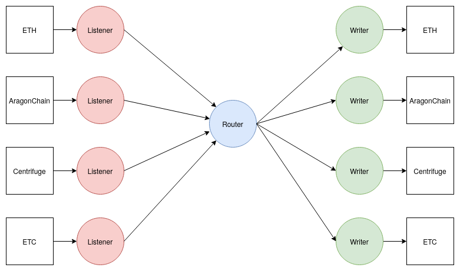
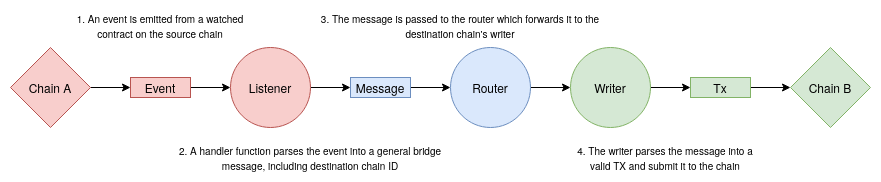

# 🌉 <b> Overview </b>

## Summary

At a high level, ChainBridge is a message passing protocol. Events on a source chain are used to create a message that is then delivered to the destination chain. We define the concept of a Listener to extract events from a chain and construct a message, and a Writer to interpret messages and submit transactions to a chain. 

## Relevant repos

### [ChainBridge](https://github.com/ChainSafe/ChainBridge)
This is the core bridging software that Relayers run between chains.

### [chainbridge-solidity](https://github.com/ChainSafe/chainbridge-solidity) 
The Solidity contracts required for chainbridge. Includes deployment and interaction CLI.
    
### [chainbridge-substrate](https://github.com/ChainSafe/chainbridge-substrate)
A substrate pallet that can be integrated into a chain, as well as an example pallet to demonstrate chain integration.

### [chainbridge-utils](https://github.com/ChainSafe/chainbridge-utils)
A collection of packages used by the core bridging software.

### [chainbridge-deploy](https://github.com/ChainSafe/ChainBridge)
Some tooling to help with deployments.

